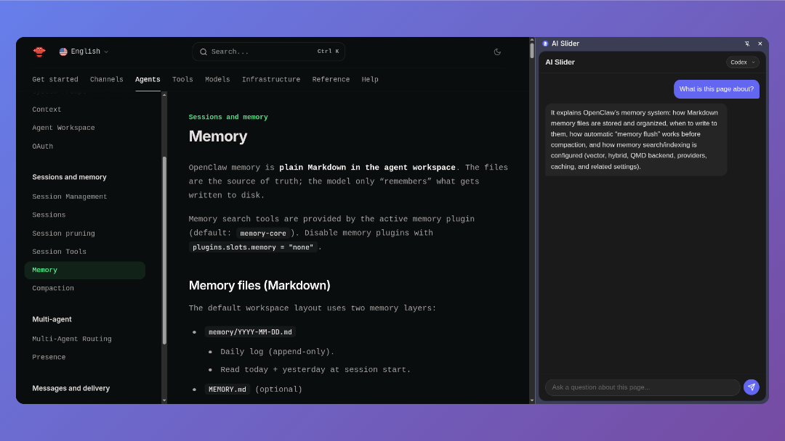

# AI Slider

A Chrome extension for quickly asking Claude or Codex questions with the current page as context.

Uses your existing Codex or Claude subscription — no API keys, no extra costs.



## Quick Start

### 1. Start the backend
```bash
cd backend
./setup.sh      # One-time setup
python main.py  # Start server
```

### 2. Load the extension
1. Go to `chrome://extensions`
2. Enable "Developer mode"
3. Click "Load unpacked" → select this folder

### 3. Use it
- Click the extension icon to open the side panel
- Or select text → right-click → "Ask AI Slider"

## Requirements
- Python 3.10+
- [Codex CLI](https://github.com/openai/codex) or [Claude CLI](https://github.com/anthropics/claude-code)

## Disclaimer

- **Prompt injection risk**: The AI reads page content, which could include hidden malicious instructions. Don't blindly trust responses on untrusted sites.
- **Data privacy**: Page content is sent to Codex/Claude via their CLI tools. Nothing is stored or sent elsewhere.
- **Not a security tool**: This is a convenience tool, not designed for analyzing suspicious content.
